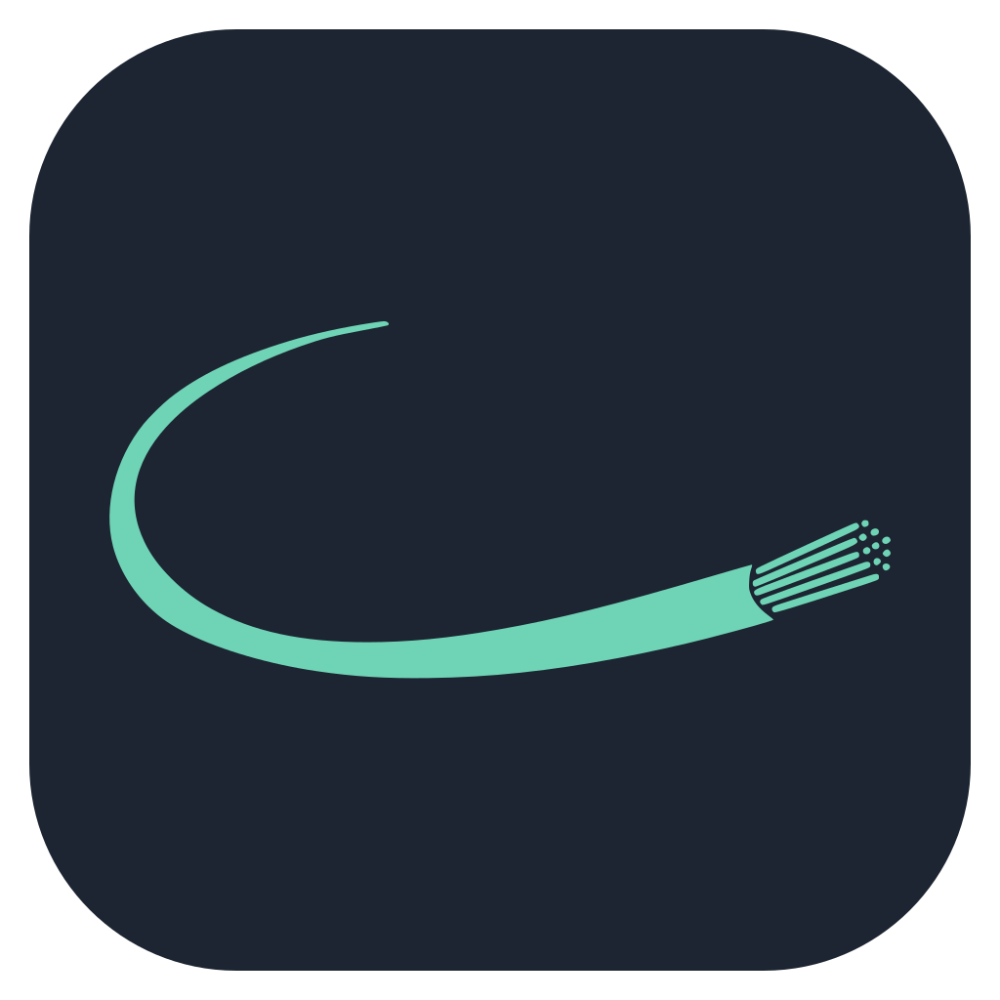
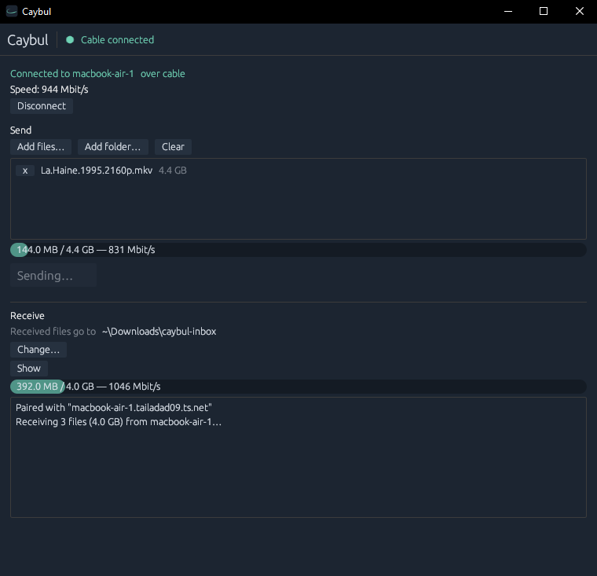

# Caybul&nbsp;

Cross-platform file transfer over a wire, with no setup.

  
   
  <em>2-way high speed file transfer over an ethernet cable</em>

Plug two computers together, open Caybul on both, drop your files in. It picks the
fastest path the cable can do and moves them. Works between macOS, Windows and
Linux in any combination.

## Cable Support

Which cables carry a link between which systems.

| | &nbsp;Mac | &nbsp;Windows | &nbsp;Linux |
|---|---|---|---|
| &nbsp;**Mac** |    |   |   |
| &nbsp;**Windows** |   |   |   |
| &nbsp;**Linux** |   |   |   |

&nbsp;Thunderbolt / USB4 &nbsp;&nbsp; &nbsp;Ethernet &nbsp;&nbsp; &nbsp;USB-C

With no cable, Caybul falls back to Wi-Fi or the local network and asks for a
confirmation code first.

Caybul reads the link type and reports the speed it measured, so you can tell
which case you're in.

## How it works

Each app announces itself on the wire and the two find each other, no addresses
to type. A wired connection counts as consent and connects directly; over Wi-Fi
it shows a code on both screens first. Files go out in chunks across several
streams, get checksummed on arrival, and resume from where they stopped if the
connection drops.

## Install

Prebuilt macOS, Windows and Linux downloads are on the
[releases page](../../releases). The builds aren't signed, so the first launch
trips Gatekeeper or SmartScreen. Open it anyway.

From source:

    cargo build --release

`caybul-gui` is the app. `caybul` is the command line:

    caybul links      # what's connected, and how fast
    caybul receive    # wait for files
    caybul send FILE  # send to whoever's listening

## Build

Uses Rust toolchain. Linux needs GTK and a few xcb libraries for the window and file dialog:

    sudo apt install libgtk-3-dev libxkbcommon-dev libxcb-render0-dev libxcb-shape0-dev libxcb-xfixes0-dev

Three crates: `caybul-core` (detection, discovery, transfer), `caybul-cli`,
`caybul-gui`.

MIT licensed.
